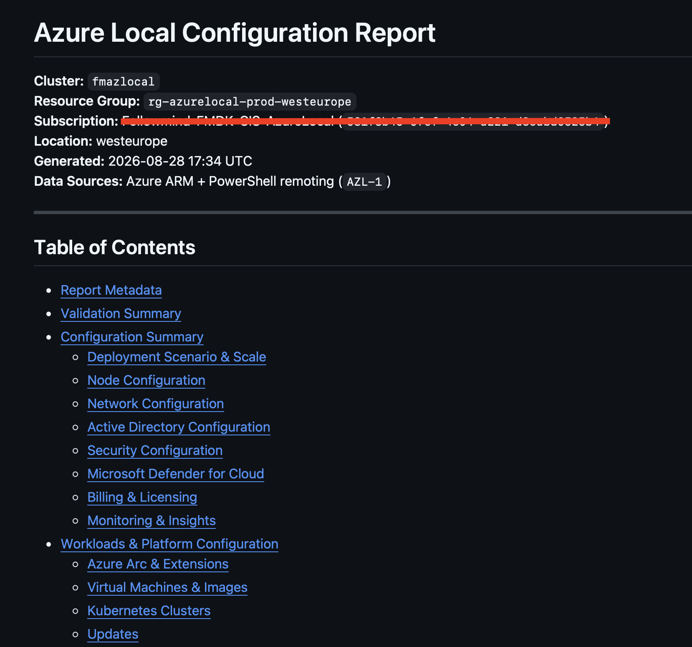
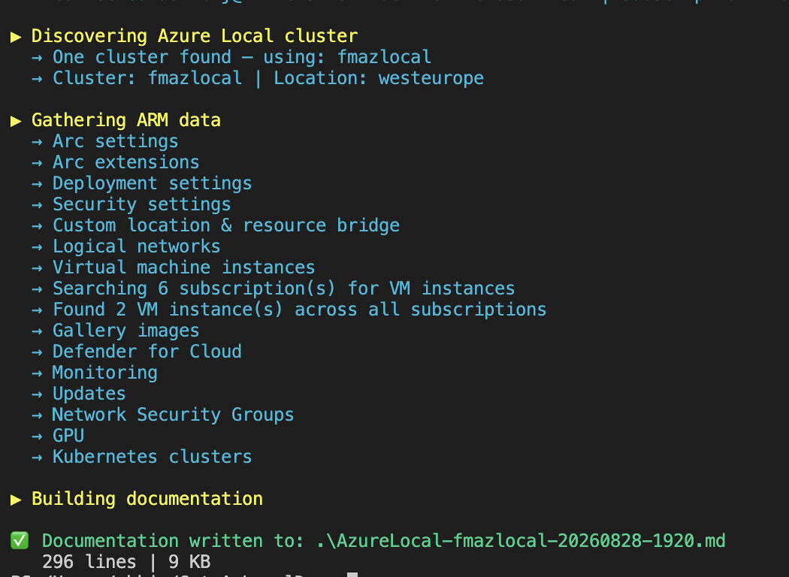

# Get-AzLocalDoc

A standalone PowerShell script that documents an existing **Azure Local** cluster by querying Azure ARM and optionally the HCI nodes directly, then produces a structured **Markdown report**.

> See [example report output](docs/example-report.md) for a sample of what the script generates.



---

## What it collects

| Source | Data |
|---|---|
| **Azure ARM** | Cluster identity, region, AAD app IDs, connectivity status |
| **Azure ARM** | Deployment settings: network intents, infrastructure IPs, node list, storage paths, AD/DNS |
| **Azure ARM** | Arc settings and all installed Arc extensions |
| **Azure ARM** | Security settings |
| **Azure ARM** | Logical networks (VLANs, subnets, DHCP, vmSwitchName) |
| **Azure ARM** | Virtual machine instances, gallery images |
| **Azure ARM** | Applied and available updates |
| **HCI Nodes** *(optional)* | Storage pools, volumes, physical disks, network adapters, cluster node state |

---

## Prerequisites

```powershell
Install-Module -Name Az.Accounts  -Scope CurrentUser
Install-Module -Name Az.Resources -Scope CurrentUser
Install-Module -Name Az.StackHCI  -Scope CurrentUser
```

For on-node collection (`-IncludeNodeData`), WinRM/PowerShell remoting must be enabled on the HCI nodes, and the `FailoverClusters` feature must be installed.

---

## Usage

### Interactive login (ARM-only)
```powershell
.\Get-AzLocalDoc.ps1 -ResourceGroupName "rg-azlocal-prod" -ClusterName "hci-cluster-01"
```



### Interactive login with on-node data
```powershell
.\Get-AzLocalDoc.ps1 `
    -ResourceGroupName "rg-azlocal-prod" `
    -ClusterName "hci-cluster-01" `
    -IncludeNodeData `
    -NodeCredential (Get-Credential)
```

### Service principal authentication
```powershell
$cred = New-Object PSCredential(
    "your-app-id",
    (ConvertTo-SecureString "your-secret" -AsPlainText -Force)
)

.\Get-AzLocalDoc.ps1 `
    -ResourceGroupName "rg-azlocal-prod" `
    -TenantId "your-tenant-id" `
    -ServicePrincipal `
    -Credential $cred
```

### Custom output path
```powershell
.\Get-AzLocalDoc.ps1 -ResourceGroupName "rg-azlocal-prod" -OutputPath "C:\docs\cluster.md"
```

---

## Output

A Markdown file with the following sections:

| Section | Contents |
|---|---|
| **R1 Report Metadata** | Cluster identity, status, provisioning state, billing model, cluster version, manufacturer, IMDS attestation, timestamps, custom location, Arc resource bridge, tags |
| **R3 Configuration Summary** | |
| — R3.1 Deployment Scenario & Scale | Deployment mode, node count, storage mode, cluster version, capabilities, attestation endpoint |
| — R3.2 Node Configuration | Per-node: IP, hardware model, OS version, serial number, CPU cores, memory, OEM activation |
| — R3.3 Host Networking, Intents & Overrides | Storage auto IP, switchless, per-intent adapter/RDMA details, storage VLANs |
| — R3.4 Infrastructure Network | Gateway, subnet mask, DNS, IP pool |
| — R3.5 Nodes Network | Per-node NIC details (requires `-IncludeNodeData`) |
| — R3.6 Active Directory | Domain FQDN, OU path, secrets location |
| — R3.7 Security Configuration | BitLocker, Credential Guard, DRTM, HVCI, WDAC, SMB signing/encryption |
| — R3.8 Microsoft Defender for Cloud | Per-plan status (Servers, Containers, SQL, Kubernetes, DNS, Storage) |
| — R3.9 Billing & Licensing | Billing model, trial days, last billing, software assurance, Windows Server Subscription |
| **R4 Validation Summary** | Live status checks: connectivity, provisioning, Arc state, extensions health, updates, Defender, logical networks |
| **R5 Workloads & Platform Configuration** | Arc extensions, logical networks (VLANs/subnets), VMs & images (cross-subscription), updates, storage |

Output file is named: `AzureLocal-<ClusterName>-YYYYMMDD-HHmm.md`

---

## Parameters

| Parameter | Required | Description |
|---|---|---|
| `-ResourceGroupName` | ✅ | Resource group containing the cluster |
| `-ClusterName` | | Cluster name (auto-detected if omitted) |
| `-SubscriptionId` | | Override the Az context subscription |
| `-TenantId` | | Required for cross-tenant auth |
| `-ServicePrincipal` | | Use service principal instead of interactive login |
| `-Credential` | With `-ServicePrincipal` | AppId + secret as PSCredential |
| `-IncludeNodeData` | | Collect on-node data via PowerShell remoting |
| `-NodeCredential` | | Credential for HCI node remoting |
| `-OutputPath` | | Output file path (default: `.\AzureLocal-<cluster>-<date>-<time>.md`) |

---

## Limitations

- **ARM-only mode** does not capture physical NIC details, storage pool internals, or per-node OS-level config — use `-IncludeNodeData` for that.
- `-IncludeNodeData` connects to the **first node only** for cluster-wide S2D data; all nodes report the same storage pool view.
- Secrets, passwords, and sensitive keys are never included (Azure ARM never returns these).
- Some resource types may require specific API versions depending on your cluster's registration age.

---

## License

MIT
